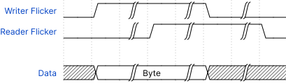

# USB communication

The controlling computer (`ext`) and the PULPINO on the FPGA (`pulpino`)
communicate via the USB interface. This communication layer is built upon the
top layers supplied by ChipWhisperer. This communication layer is used to
program the RAM of the chip and be used to exchange information afterwords. The
protocol is a simple synchronous *Send and Acknowledge* protocol and is
transferred over the `GPIO` to and from the PULPINO.

This document contains two sections

- [Implementation Overview](#implementation-overview): overview of all the files
  involved in the implementation
- [Wire Definitions](#wire-definitions): outlines the signals used on the `GPIO`
  wires
- [Protocol Pseudocode](#protocol-pseudocode): pseudocode describing the steps
  the protocol takes

## Implementation Overview

The ChipWhisperer repository defines the `fpga_read` and `fpga_write` functions
with a set of top-level Verilog files to allow for some communication between
the controlling computer and the FPGA program. Even though, there may be much
better ways (e.g. UART with SimpleSerial), we use these functions to communicate
with the PULPINO because of its simplicity.

The `pulpino.py` python file declares a set of registers that are also defined
in the `cw305_defines.v` files. It then provides an interface that is able to
read and write from these registers. These registers are controlled by the
`cw305_reg_pulpino.v` file, which are passed through to the PULPINO chip in the
`cw305_top.v`. 

Note that there is also a `dummy_pulpino.v` which mimics the communication. This
can be used for testing. It reads two bytes and then writes out all the bytes
between the two gives bytes.

## Wire Definitions

### `GPIO_IN`

```
[9]:   ext_read_flicker: coordination signal for EXT for data from PULPINO
[8]:   ext_write_flicker: coordination signal for EXT for data to PULPINO
[7:0]: data
```

### `GPIO_OUT`

```
[9]:   pulpino_read_flicker: coordination signal for PULPINO for data from EXT
[8]:   pulpino_write_flicker: coordination signal for PULPINO for data to EXT
[7:0]: data
```

## Protocol Pseudocode

The communication protocol is implemented in both directions according to the
following wave diagram.



### External <> Pulpino

```python
# Reads a byte from the EXT to the PULPINO synchronously
def pulpino_read():
    await ext_write_flicker != 1

    byte = GPIO_IN.data

    pulpino_read_flicker = 1
    await ext_write_flicker != 0
    pulpino_read_flicker = 0

    return byte

# Writes a byte from the PULPINO to the EXT synchronously
def pulpino_write(byte):
    await ext_read_flicker != 1

    GPIO_OUT.data = byte

    pulpino_write_flicker = 1
    await ext_read_flicker != 0
    pulpino_write_flicker = 0

# Reads a byte from the PULPINO to the EXT synchronously
def ext_read():
    await pulpino_write_flicker != 1

    byte = GPIO_OUT.data

    ext_read_flicker = 1
    await pulpino_write_flicker != 0
    ext_read_flicker = 0

    return byte

# Writes a byte from the EXT to the PULPINO synchronously
def ext_write(byte):
    await pulpino_read_flicker != 1

    GPIO_IN.data = byte

    ext_write_flicker = 1
    await pulpino_read_flicker != 0
    ext_write_flicker = 0
```