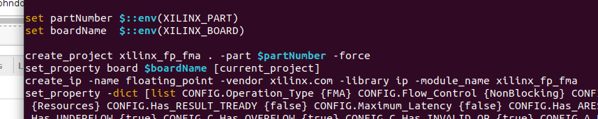
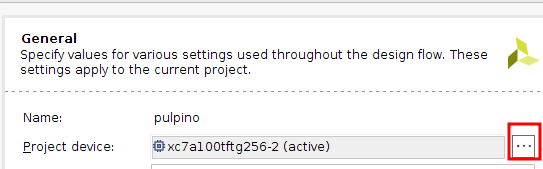
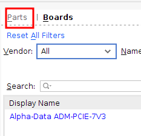

# PULPINO on ChipWhisperer 305

This repository contains the steps needed to generate the [PULPINO][pulpino]
bitstream for a [ChipWhisperer 305][cw305] (CW305) board with a Artix 7.
Specifically, these instructions target the *Arty A7-100T* board variant,
although they may also work with the *Arty A7-35T* board. Steps are outlined
below.

## Steps

The following steps explain how to set up the [PULPINO][pulpino] core for a
CW305. This assumes basic familiarity the Linux terminal and [Vivado][vivado].
There are 3 sections. First, there are some requirements which should be met
before going to the next steps. Then, there are steps to follow in the Linux
terminal. Lastly, there are the steps to follow in [Vivado][vivado].

### Requirements

- A Linux PC
- [Xilinx Vivado 2019.1][vivado]. This specific version can be found in the
  `Vivado Archive`. This may work on other versions of Vivado, but it has not
  been tested.
- [Board Files compatible with the CW305][boardfiles]
- [PyEnv][pyenv]
- `build-essential` for GCC, GIT, etc.
- Any text editor

### In a Terminal

1. Clone this repository somewhere.
2. In the terminal, run `pyenv init` and follow the outlined steps.
3. Afterwards, run `pyenv install 2.7.18` and `pyenv shell 2.7.18`
4. Install the `yaml` module with `pip install pyyaml`
5. Clone with `git clone https://github.com/pulp-platform/pulpino.git`
6. Go into the just cloned folder with `cd pulpino`.
7. Copy over the `build_env.sh` from this repository into the working directory.
8. Adjust the `XILINX_PATH` in the `build_env.sh` to reflect your Xilinx Vivado
   2019.1 installation path. This folder will contain a `Vivado` and an `SDK`
   subfolder. It is usually `/opt/Xilinx` or `/tools/Xilinx`.
6. Source the `build_env.sh` with `source build_env.sh`.
7. Verify that you have the proper python version, by running `python
   --version`. This should be `2.7.18`. If it is not, rerun `pyenv shell
   2.7.18`.
8. Run the `./update-ips.py` script from the pulpino repository.
9. Open `fpga/ips/xilinx_fp_fma/tcl/run.tcl`.
   1. At line ~13, append ` -force` to the line.
   2. At line ~15, remove ` -version 7.0`
   
10. `cd fpga` and `make all`. This will take quite some time and fail but that is
   expected.

### Inside Vivado

1. Open `fpga/pulpino/pulpino.xpr` in Vivado 2019.1.
2. Go to `Tools -> Settings -> General -> Project Device`. Click the `...`. Go
   to the `Parts` tab.
  
  
  1. Select `xc7a100tftg256-2`. If it does not show up, verify you have
	 installed the board files. If you have the Arty A7-35T variant, you can
	 use `xc7a35tftg256-2`, but this is untested.
  2. Click `Apply` and exit menu
  3. This gives a warning. Click okay and accept `synth_2`.
3. Right click on the `Design Sources` in the `Sources` tab and click `Add
   Sources...`.
   1. Select `Add or create design sources` and click next.
   2. Click `Add files`, navigate to this repository, and select the `clocks.v`,
      `cw305_defines.v`, `cw305_top.v`, `cw305_reg_pulpino` and
      `cw305_usb_reg_fe.v` files from the
      [`modules`](./modules) folder in this repository.
   3. Select `Copy sources into project` and click `Finish`.
4. Now, right click on the `Design Sources` in the `Sources` tab and click `Add
   Sources...` again.
   1. Select `Add or create constraints` this time and click next.
   2. Select the [`cw305_main.xdc`](./modules/cw305_main.xdc) from the
      [`modules](./modules) folder in this repository.
   3. Select `Copy sources into project` and click `Finish`.
5. In the `Sources` tab under `Design Sources`, navigate to `cw305_top`, right
   click and select `Set as top`.
6. In the `Sources` tab under `Constraints`, navigate to `cw305_main`, right
   click and select `Set as Target Constraint File`.
7. Open the `./rtl/bootcode.sv` and replace the content of the `mem` array with
   the content of [`bootcode_program`](../program/target/out/bootcode_program).
8. Run Synthesis.
9. Run Implementation.
10. Generate the Bitstream.

## Making Changes

If you want to make changes to the Netlist now, you can make your changes in
Vivado and run the Synthesis, Implementation, Bitstream steps again. None of
the earlier steps need to be reproduced.

## Common Errors

### `vivado: No such file or directory`

```
make[1]: vivado: No such file or directory
make[1]: *** [Makefile:4: all] Error 127
make[1]: Leaving directory '/home/johndoe/Documents/test-pulpino/fpga/ips/xilinx_clock_manager'
make: *** [Makefile:13: ips/xilinx_clock_manager/ip/xilinx_clock_manager.dcp] Error 2
```

To fix this, ensure that both the `Vivado/bin` and `SDK/bin` are in your path.
This can be done by adjusting the `build_env.sh` file to contain the proper
`XILINX_PATH` and then sourcing the `build_env.sh` file from this repository
with `source ./build_env.sh`. 

## Credits

These steps were formed by the joined work of:
- Yiheng CAO ([@cyhopensource](https://github.com/cyhopensource))
- Roua BOULIFA ([@roua987](https://github.com/roua987))
- Gijs BURGHOORN ([@coastalwhite](https://github.com/coastalwhite))

[cw305]: https://www.newae.com/products/NAE-CW305
[pulpino]: https://github.com/pulp-platform/pulpino
[vivado]: https://www.xilinx.com/support/download.html
[boardfiles]: https://digilent.com/reference/programmable-logic/guides/installing-vivado-and-sdk#installing_digilent_board_files
[pyenv]: https://github.com/pyenv/pyenv
